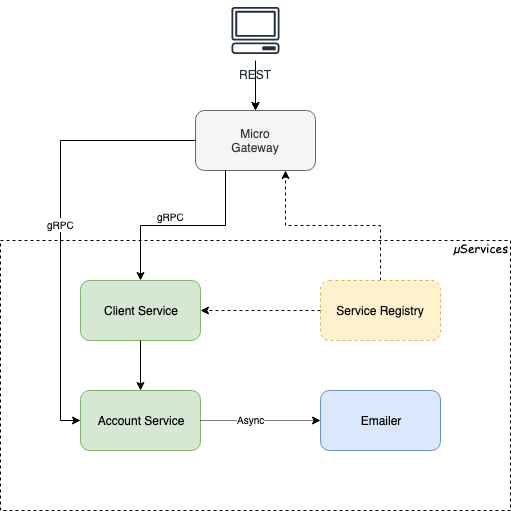

# micro-starter-kit

Microservices starter kit for **Golang**, aims to be developer friendly.

[](https://godoc.org/github.com/xmlking/micro-starter-kit)
[](https://golang.org/dl/)
[](https://renovatebot.com/)
[](https://opensource.org/licenses/MIT)

### Build Status

[](https://github.com/xmlking/micro-starter-kit/actions?query=branch%3Adevelop+event%3Apush+workflow%3A%22Test+on+Push%22)

### Quality

[](https://goreportcard.com/report/github.com/xmlking/micro-starter-kit)
[](https://lgtm.com/projects/g/xmlking/micro-starter-kit/alerts/)
[](https://codecov.io/gh/xmlking/micro-starter-kit)
[](https://lgtm.com/projects/g/xmlking/micro-starter-kit/context:go)
[](https://app.fuzzit.dev/orgs/xmlkinggithub/dashboard)

## Overview



### What you get

- [x] Monorepo - Sharing Code Between Microservices
- [x] gRPC microservices with REST Gateway
- [x] Input Validation with [protoc-gen-validate (PGV)](https://github.com/envoyproxy/protoc-gen-validate)
- [x] Config - Pluggable Sources, Mergeable Config, Safe Recovery
- [x] Customizable Logging
- [x] CRUD Example using [GORM](https://gorm.io/), [benchmarks](https://github.com/kihamo/orm-benchmark), [XORM](https://xorm.io/) next?
- [x] GORM code gen via [protoc-gen-gorm](https://github.com/infobloxopen/protoc-gen-gorm) or use [protoc-go-inject-tag](https://github.com/favadi/protoc-go-inject-tag)?
- [x] Dependency injection [Container](https://github.com/sarulabs/di), Try [wire](https://itnext.io/mastering-wire-f1226717bbac) next?
- [x] multi-stage-multi-target Dockerfile
- [x] One Step _build/publish/deploy_ with [ko](https://github.com/google/ko)
- [x] BuildInfo with [govvv](https://github.com/ahmetb/govvv)
- [x] Linting with [GolangCI](https://github.com/golangci/golangci-lint) linters aggregator
- [x] Linting Protos with [Buf](https://buf.build/docs/introduction)
- [x] CICD Pipelines with [GitHub Actions](https://github.com/features/actions)
- [x] Kubernetes _Matrix Deployment_ with [Kustomize](https://kustomize.io/)
- [ ] Add k8s [healthchecks](https://github.com/heptiolabs/healthcheck) with [cmux](https://medium.com/@drgarcia1986/listen-grpc-and-http-requests-on-the-same-port-263c40cb45ff)
- [x] Feature Flags (enable/disable with zero cost)
- [ ] Observability
- [ ] Service Mesh with [Istio](https://istio.io/)
- [ ] GraphQL Gateway with [gqlgen](https://gqlgen.com/), [rejoiner](https://github.com/google/rejoiner),[gqlgen](https://github.com/Shpota/skmz)
- [ ] Graph-Based ORM [ent](https://entgo.io/)
- [ ] Switch to [Bazel Build](https://bazel.build/)

## Getting Started

### Prerequisite

Refer [prerequisites](docs/prerequisites.md) docs

### Initial Setup

Also Refer [scaffolding](docs/scaffolding.md) docs

> clone the repo

```bash
git clone https://github.com/xmlking/micro-starter-kit ~/Developer/Work/go/micro-starter-kit
# pull dependencies (when every time `go.mod` changed)
go mod download
```

### Run

#### Database

By default this project use embedded `sqlite3` database. if you want to use **postgreSQL**,

- start **postgres** via `docker-compose` command provided below
- uncommend `postgres` import statement and comment `sqlite` in `plugin.go`
- start micro server with `--configFile=config.dev.postgres.yaml` flag <br/>
  i.e., `go run srv/account/main.go srv/account/plugin.go --configFile=config.dev.postgres.yaml`

```bash
# to start postgres in foreground
docker-compose up postgres
# to stop postgres
docker-compose down
# if needed, remove `postgres_data` volume to recreate database next time, when you start.
docker system prune --volumes
```

#### Services

> Node: `--server_address=localhost:5501x` required only when you are behind VPN a.k.a `Work From Home`

```bash
# dev mode
make run-account
# or
make run-account ARGS="--server_address=localhost:55011"
# or
go run srv/account/main.go srv/account/plugin.go \
--configDir deploy/bases/account-srv/config \
--server_address=0.0.0.0:55011 --broker_address=0.0.0.0:55021

make run-greeter
# or
make run-emailer ARGS="--server_address=localhost:55012"

make run-emailer
# or
make run-emailer ARGS="--server_address=localhost:55013"

make run-recorder
# or
make run-recorder ARGS="--server_address=localhost:55014"


# integration tests for config module via CMD
make run TARGET=demo TYPE=cmd
go run cmd/demo/main.go --help
go run cmd/demo/main.go --database_host=1.1.1.1 --database_port=7777

export APP_ENV=production
go run cmd/demo/main.go
```

### Test

Refer [testing](docs/testing.md) docs

## GitOps

### Make

Refer [makefile](docs/makefile.md) docs

### Docker

Refer [docker](docs/docker.md) docs

### Release

Refer [releasing](docs/releasing.md) docs

### Deploy

```bash
make docker DOCKER_REGISTRY=docker.pkg.github.com DOCKER_CONTEXT_PATH=xmlking/micro-starter-kit
docker rmi $(docker images -f "dangling=true" -q)

# make kustomize OVERLAY=e2e NS=default VERSION=v0.1.0-440-g6c7fb7a
make kustomize
kubectl apply -f build/deploy.yaml

POD_NAME=$(kubectl get pods  -lapp.kubernetes.io/name=account-srv -o jsonpath='{.items[0].metadata.name}')
kubectl logs -f -c srv $POD_NAME

kubectl delete -f build/deploy.yaml
```

## Reference

### Project Docs

1. [prerequisites](docs/prerequisites.md)
2. [scaffolding](docs/scaffolding.md)
3. [makefile](docs/makefile.md)
4. [testing](docs/testing.md)
5. [docker](docs/docker.md)
6. [gitops](docs/gitops.md)
7. [releasing](docs/releasing.md)
8. [Protobuf Style Guide](https://buf.build/docs/style-guide)
9. [Google Protobuf Style Guide](https://github.com/uber-go/guide/blob/master/style.md)

### External Docs

1. [Go-Micro Getting Started](https://itnext.io/micro-in-action-getting-started-a79916ae3cac)
2. [examples](https://github.com/micro/examples) - example usage code for micro
3. [microhq](https://github.com/microhq) - a place for prebuilt microservices
4. [explorer](https://micro.mu/explore/) - which aggregates micro based open source projects
5. [micro-plugins](https://github.com/micro/go-plugins) extensible micro plugins
6. [step-by-step-guide-micro](https://github.com/micro-in-cn/tutorials/tree/master/microservice-in-micro)
7. [micro-in-cn](https://github.com/micro-in-cn/tutorials/tree/master/examples)
8. [Platform Web](https://github.com/micro-in-cn/platform-web)
9. [grpc template](https://github.com/vtolstov/micro-template-grpc)
10. [Simple API backed by PostgresQL, Golang and gRPC](https://medium.com/@vptech/complexity-is-the-bane-of-every-software-engineer-e2878d0ad45a)
