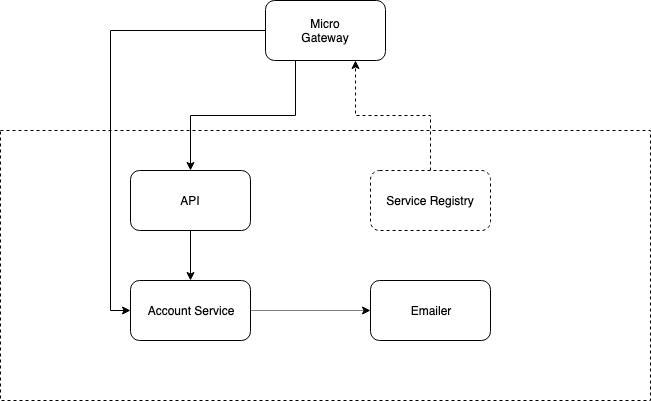

# micro-starter-kit

> go-micro starter kit



## What you get

- [x] Monorepo - Sharing Code Between Microservices
- [x] gRPC microservices with REST Gateway
- [x] Input Validation
- [x] Config Fallback
- [x] Custom Logging
- [x] CRUD via ORM
- [x] DI Container
- [x] One Step _build/publish/deploy_ with `ko`
- [x] BuildInfo with `govvv`
- [ ] Observability
- [ ] Service Mesh
- [ ] GraphQL Gateway with `gqlgen`

## TODO

- [ ] [protoc-gen-gorm](https://github.com/infobloxopen/protoc-gen-gorm)

## Prerequisite

### Global tools

> run then outside **project home** and `$GOPATH`

```bash
# fetch micro into $GOPATH
go get -u github.com/micro/micro
go get -u github.com/micro/go-micro
# go lang  build/publish/deploy tool
go get -u github.com/google/ko/cmd/ko
# go better build tool
go get github.com/ahmetb/govvv
# for mac, use brew to install protobuf
brew install protobuf

# fetch protoc plugins into $GOPATH
go get -u github.com/golang/protobuf/{proto,protoc-gen-go}
go get -u github.com/micro/protoc-gen-micro
# fetch PGV protoc plugin
go get -u github.com/envoyproxy/protoc-gen-validate
```

## Initial Setup

> (optional) setup your workspace from scratch

```bash
go mod init github.com/xmlking/micro-starter-kit
mkdir srv api fnc

# scaffold modules
micro new --namespace="go.micro" --type="srv" --gopath=false --alias="account" srv/account

micro new --namespace="go.micro" --type="srv" --gopath=false \
--alias="emailer"  --plugin=registry=mdns:broker=nats srv/emailer

micro new --namespace="go.micro" --type="api" --gopath=false --alias="account" api/account
```

## Build

```bash
make proto
# silence
make -s proto

# prod build. Build with plugins.go
go build -o build/account-srv ./srv/account
```

## Run

> Optionally start postgres and set it in `config.yaml`

```bash
postgres
docker-compose up postgres
```

> Node: `--server_address=<MY_VPM_IP>:5501x --broker_address=<MY_VPN_IP>:5502x` required only when you are behind VPN

```bash
# dev mode
# test account srv (plugin adds custom logger )
# MY_VPM_IP=$(ifconfig | grep 172 | awk '{print $2; exit}')
# go run srv/account/main.go srv/account/plugin.go --server_address=${MY_VPN_IP}:55011 --broker_address=${MY_VPN_IP}:55021
go run srv/account/main.go srv/account/plugin.go
# go run srv/emailer/main.go srv/emailer/plugin.go --server_address=${MY_VPN_IP}:55012 --broker_address=${MY_VPN_IP}:55022
go run srv/emailer/main.go srv/emailer/plugin.go

# prod mode
MICRO_BROKER=nats \
MICRO_REGISTRY=kubernetes \
MICRO_TRANSPORT=nats \
./build/account-srv

# test config with CMD
go run cmd/demo/main.go --help
go run cmd/demo/main.go --database_host=1.1.1.1 --database_port=7777

export APP_ENV=production
go run cmd/demo/main.go
```

## Test

> using `micro` CLI

```bash
micro list services
micro get service go.micro.srv.account

# Start API Gateway
micro api --namespace=go.micro.srv
# (or) Start Web UX for testing
micro web --namespace=go.micro.srv
```

### Test gRPC Directly

```bash
micro call go.micro.srv.account UserService.Create \
'{"username": "sumo", "firstName": "sumo", "lastName": "demo", "email": "sumo@demo.com"}'
micro call go.micro.srv.account UserService.List '{}'
micro call go.micro.srv.account UserService.Get '{"id": 1}'
```

### Test via Micro Web UI

```bash
open http://localhost:8082
```

> create new user from `Micro Web UI` and see if an email is send

```json
{
  "username": "sumo",
  "firstName": "sumo",
  "lastName": "demo",
  "email": "sumo@demo.com"
}
```

### Test via Micro API Gateway

> Start `API Gateway` and run **REST Client** [tests](test/test-rest-api.http)

## Deploy

Use `ko`. If you are new to `ko` check out the [ko-demo](https://github.com/xmlking/ko-demo)

Set a registry and make sure you can push to it:

```bash
export PROJECT_ID=ngx-starter-kit
export KO_DOCKER_REPO=gcr.io/${PROJECT_ID}
```

Then `apply` like this:

```bash
ko apply -f deploy/
```

To deploy in a different namespace:

```bash
ko -n nondefault apply -f deploy/
```

## Release

> This will publish all of the binary components as container images and create a release.yaml

```bash
ko resolve -P -f deploy/ > release.yaml
```

### Workaround

ko does not work with `Go Modules` yet. [WIP](https://github.com/google/ko/issues/7)

As a workaround I symlinked my source code into the default GOPATH (~/go/src/...)

```bash
cd ~/go/src/github.com/xmlking
ln -s /Developer/Work/go/micro-starter-kit .
```

## Docker

### Docker Build

```bash
# build
VERSION=0.0.1-SNAPSHOT
BUILD_PKG=./srv/account
IMANGE_NAME=xmlking/account-srv
docker build --rm \
--build-arg VERSION=$VERSION \
--build-arg BUILD_PKG=$BUILD_PKG \
--build-arg BUILD_DATE=$(date -u +'%Y-%m-%dT%H:%M:%SZ') \
-t $IMANGE_NAME .

# tag
docker tag $IMANGE_NAME $IMANGE_NAME:$VERSION

# push
docker push $IMANGE_NAME:$VERSION
docker push $IMANGE_NAME:latest

# check
docker inspect  $IMANGE_NAME:$VERSION
# remove temp images after build
docker image prune -f
docker rmi $(comm -3 <(docker images -q | sort) <(docker images -q -a | sort)  | sed 's/\t//')
```

### Run Docker

```bash
docker run -it \
-e MICRO_SERVER_ADDRESS=0.0.0.0:8080 \
-e MICRO_BROKER_ADDRESS=0.0.0.0:10001 \
-e MICRO_REGISTRY=mdns \
-p 8080:8080 -p 10001:10001 $IMANGE_NAME
```

### Make

> use `-n` flag for `dry-run`, `-s` or '--silent' flag to suppress echoing

```bash
# codegen from proto
make proto
make proto TARGET=account
make proto TARGET=account TYPE=api

# build
make build VERSION=v0.1.1
make build TARGET=account VERSION=v0.1.1
make build TARGET=account TYPE=srv VERSION=v0.1.1
make build TARGET=emailer TYPE=srv VERSION=v0.1.1
make build TARGET=account TYPE=api VERSION=v0.1.1

# push tag to git
make release VERSION=v0.1.1

# build docker image
make docker TARGET=account VERSION=v0.1.1
make docker TARGET=account TYPE=srv VERSION=v0.1.1
```

## Reference

1. [examples](https://github.com/micro/examples) - example usage code for micro
2. [microhq](https://github.com/microhq) - a place for prebuilt microservices
3. [explorer](https://micro.mu/explore/) - which aggregates micro based open source projects
4. [micro-plugins](https://github.com/micro/go-plugins) extensible micro plugins
