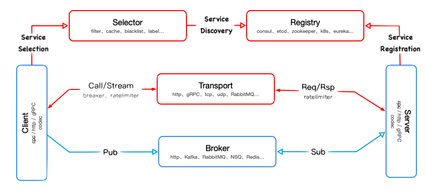

# HOWTO

- go-micro service interactions

  

- How to update 3rd party dependencies?

```bash
go get -u # to use the latest minor or patch releases
go get -u=patch # to use the latest patch releases
go mod tidy
```

- How to Prepare for a Release?

```bash
go mod tidy
go test all
```

- How to implement integration tests?

  ```go
    func TestEmailService_Welcome(t *testing.T) {
      t.Parallel()
      //...
    }

    func TestEmailService_Welcome_Invalid(t *testing.T) {
        t.Parallel()
        //...
    }

    func TestEmailService_Welcome_Integration(t *testing.T) {
        if testing.Short() {
            t.Skip("skipping integration test")
        }
        //...
    }
  ```

  Notice the last test has the convention of:

  - using `Integration` in the test name.
  - checking if running under `-short` flag directive.

  Basically, the spec goes:

  > "write all tests normally. if it is a long-running tests, or an integration test, follow this naming convention and check for `-short`"

  When we want to run our unit tests, we would use the -short flag, and omit it for running our integration tests or long running tests.

  > Use `t.Errorf` `t.Logf` for logging. don't use `logrus` or default `log`

  ```bash
  # Run only Unit tests:
  go test -v -short
  go test -v -short ./srv/emailer/service
  # Run only Integration Tests: Useful for smoke testing canaries in production.
  go test -v -run Integration
  go test -v -run Integration ./srv/emailer/service
  ```

  Refer

  - [separating-tests-in-go](https://filipnikolovski.com/separating-tests-in-go/)
  - [advanced testing tips & tricks](https://medium.com/@povilasve/go-advanced-tips-tricks-a872503ac859)

- Why some ORM model fields are pointers?

  all fields having a zero value, like 0, '', false or other [zero values](https://tour.golang.org/basics/12), <br/>
  won’t be saved into the database but will use its default value.<br/>
  If you want to avoid this, consider using a pointer type or scanner/valuer, e.g:

  ```go
  // Use pointer value
  type User struct {
  gorm.Model
  Name string
  Age  *int `gorm:"default:18"`
  }

  // Use scanner/valuer
  type User struct {
  gorm.Model
  Name string
  Age  sql.NullInt64 `gorm:"default:18"`
  }
  ```

  **Note:** google wrapper types google.protobuf.StringValue, .BoolValue, .UInt32Value, .FloatValue, etc. map to <br/>
  pointers of the internal type at the ORM level, e.g. *string, *bool, *uint32, *float <br/>

- How to run `go-micro` gRPC services and `Micro` REST Gateway on k8s?

  SO you want to use k8s internal `CoreDNS` as `service registry`, then you have to follow some rules:

  - Service name cannot have `.`(dot) due to k8s DNS limits, so make it simple via environment variables e.g., `MICRO_SERVER_NAME=account`
  - custom build REST Gateway as `microhq/micro:kubernetes` image is outdated. optionally add CORS plugin.
