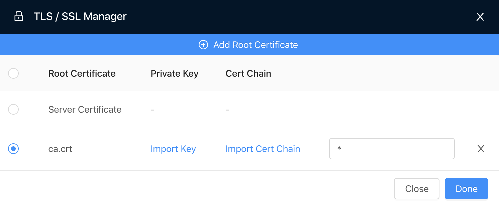
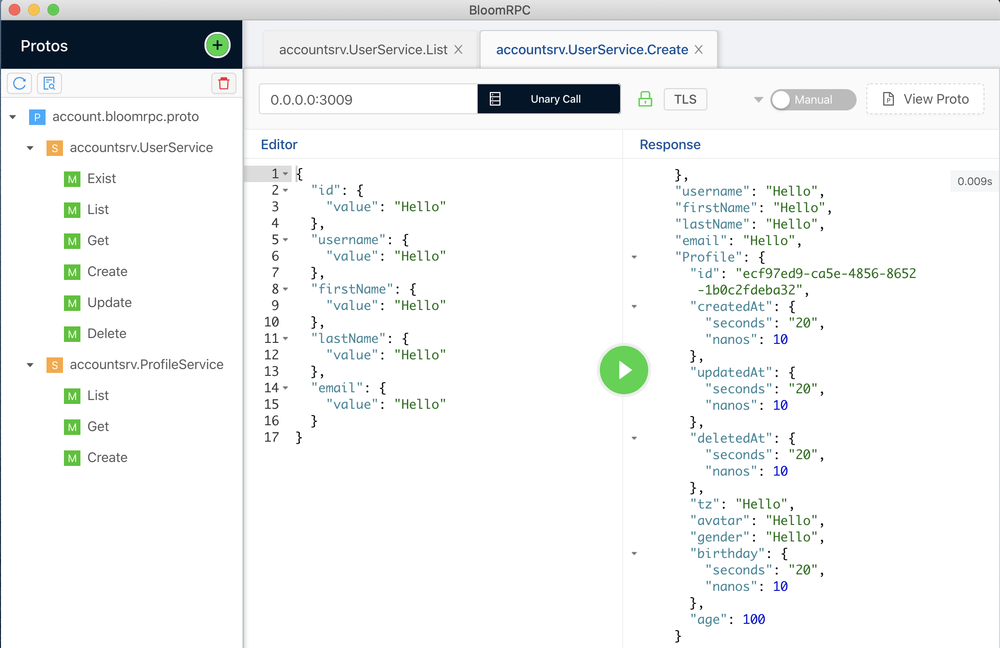

BloomRPC

> **BloomRPC** is a UI client for testing gRPC services.

### Prerequisites

```bash
# gRPC mock server for testing (optional)
yarn global add bloomrpc-mock
# install `bloomrpc` via `brew` into ~/Applications)
brew cask install --appdir=~/Applications bloomrpc
```

> Assume you generated `TLS` certs as per [mtls](mtls.md) and running `Account` gRPC microservice locally, Or
> started mock gRPC service using [bloomrpc-mock](mock.md)

### Using BloomRPC Client

1. Import paths by clicking `Import paths` icon

   

2. Import protos by clicking `Import Protos` icon and adding `e2e/account.bloomrpc.proto`

   Select `[service].[method]` to test, make sure the `Port` is correct, and click `TLS` button and add CA Cert.

   Add `*` for `ssl target host` input field.

3. Add Root CA cert.

   

4. Call the service method

   
